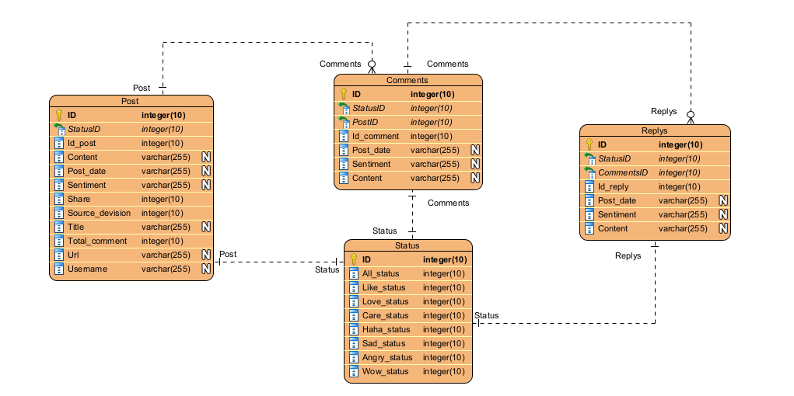

## Crawling data
```bash
python crawl(url, keyword)
```

## Input
- url : đường link nhóm cần crawl
- keyword: từ khóa tìm kiếm

## Output
```bash
{
    "id": 1,
    "post_date": "30-9-2022 08:25",
    "username": "Tờ Jan",
    "setiment": "01",
    "source_division": "01",
    "title": "Một sáng mùa Thu Hà Nội",
    "content": "Một sáng mùa Thu Hà Nội. Mùa thu, mùa mà Hà Nội đẹp như tranh, tình như thơ. Lá vàng rơi, mùi hoa sữa, không khí trong lành, mát mẻ là những thứ rất đặc trưng mà chỉ mùa thu Hà Nội mới có. Kiếm cho mình một người lang thang cùng để ôm trọn mùa thu này vào tim.",
    "url": "https://www.facebook.com/halotravel.hanoi/posts/pfbid02JKYRqdPF8Y1nHNv856ktjW2TdDYVquXqXDSMtkTjQ1N6QqjBxzedfQGwoSMBvF5al",
    "share": "13 lượt chia sẻ",
    "total comment": "161 bình luận",
    "status_dict": {
        "All": 108,
        "Like": 107,
        "Love": 1,
        "Care": 0,
        "Haha": 0,
        "Sad": 0,
        "Angry": 0,
        "Wow": 0
    },
    "comments": [
        {
            "id": 1,
            "post_date": "30-9-2022 09:25",
            "post_item_id": 1,
            "setiment": "01",
            "content": "Bạn nào đi rồi hướng dẫn giúp mình lịch trình 1 ngày để có đc bộ ảnh của mùa thu HN với đám bạn thân với nạ",
            "status_dict": {
                "All": 0,
                "Like": 0,
                "Love": 0,
                "Care": 0,
                "Haha": 1,
                "Sad": 0,
                "Angry": 0,
                "Wow": 0
                },
            "replys": [
                {
                    "id": 1,
                    "post_date": "30-9-2022 09:28",
                    "post_item_id": 1,
                    "setiment": "01",
                    "content": "NấmHương MộcNhĩ muốn chụp thu HN hả",
                    "status_dict": {
                            "All": 0,
                            "Like": 1,
                            "Love": 0,
                            "Care": 0,
                            "Haha": 0,
                            "Sad": 0,
                            "Angry": 0,
                            "Wow": 0
                        }
                }
            ]
        }
    ]
}
```

## CSDL

<p float="left" align="center">
      
</p>

