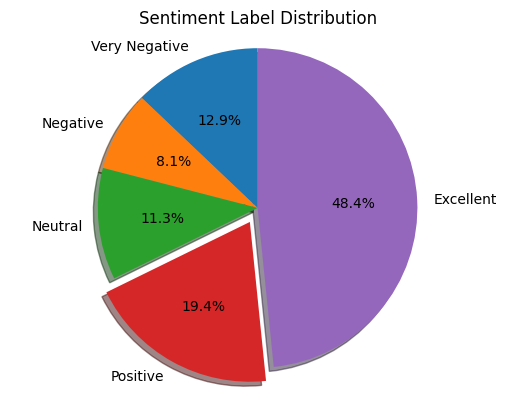
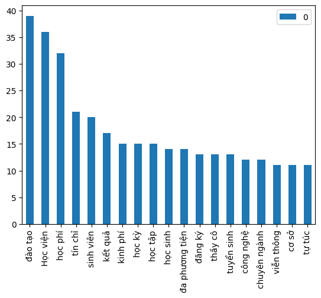

## Crawling data
```bash
python sentiment_entity(path)
```

## Input
- path: đường dẫn đến file comments.csv để lấy thông tin comment

## Output
- count_label: thống kê số lượng nhãn cảm xúc
{'negative': 101, 'neutral': 815, 'positive': 587}
- count_word: thống kê tần suất xuất hiện của các từ 
{'đào tạo': 30, 'học viện': 29, 'học phí': 22, 'tín chỉ': 17}


## THỐNG KÊ NHÃN

<p float="left" align="center">
      
</p>


## THỐNG KÊ TỪ

<p float="left" align="center">
      
</p>

